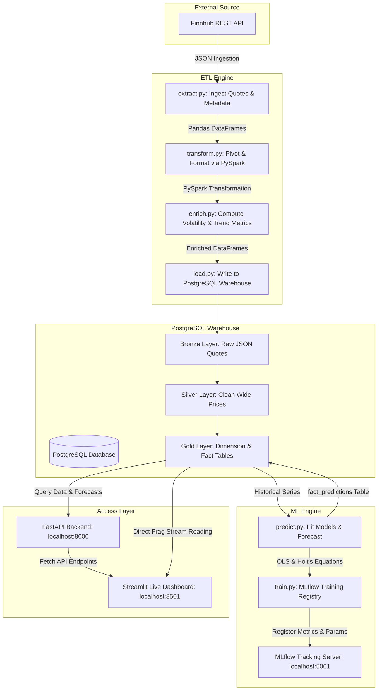

# 📈 Finnhub Real-Time Stock Streaming Pipeline & ML Forecasting Dashboard

[](https://www.python.org/)
[](https://spark.apache.org/)
[](https://www.postgresql.org/)
[](https://fastapi.tiangolo.com/)
[](https://streamlit.io/)
[](https://mlflow.org/)
[](https://www.docker.com/)

A premium, production-grade real-time stock market data engineering pipeline, analytical warehouse, and predictive machine learning forecasting dashboard. The application extracts streaming market quotes via the Finnhub API, processes them using PySpark, stores them in a multi-layered PostgreSQL database (Bronze, Silver, Gold), trains double exponential smoothing models logged to MLflow, and exposes the analytics via a robust FastAPI backend and an interactive, highly polished dark-themed Streamlit dashboard.

---

## 🏛️ Comprehensive Architecture & Flow

The system is built as a modular, containerized multi-service architecture using Docker Compose. The diagram below illustrates the end-to-end data flow from the external financial APIs to the final visualization and tracking layers:



---

## 💎 Features Overview

1. **Robust Streaming ETL Engine:** Extract real-time quotes from the Finnhub API and transform raw values with high-performance PySpark schemas.
2. **Multi-Layered Data Warehouse:** Designed using clean database warehousing practices featuring **Bronze** (raw landing), **Silver** (cleaned wide structure), and **Gold** (analytical star schema dimensions & facts) layers.
3. **Double ML Forecasting Suite:** Dynamically fits two distinct mathematical models—Ordinary Least Squares (OLS) Linear Trend and Holt's Double Exponential Smoothing (with damped trend)—to project future stock pricing.
4. **Centralized MLflow Tracking Server:** Logs every training run's hyperparameters (horizons, tickers, indicators), performance metrics ($MAE$, $RMSE$, $MAPE$, $R^2$), and prediction datasets in a centralized Postgres-backed MLflow Registry.
5. **FastAPI Serving Layer:** Exposes clean REST API endpoints for live price polling, commodity lists, historical trends, model predictions, and stock comparisons.
6. **Polished Dark-Theme Streamlit Dashboard:** An interactive, premium user interface incorporating state-of-the-art visual assets, responsive custom CSS, spline chart visualization, and shaded ML forecasting confidence bands.

---

## 🛠️ Dashboard Enhancements & Hotfixes

We recently implemented **10 critical visual and functional enhancements** to provide a high-end, premium look and resolve existing runtime exceptions:

1. **🔢 1-Based DataFrame Indexing:** Reconfigured the tables inside the dashboard (such as the watchlist and prediction views) to start indexing at `1` instead of the pandas default `0`, making the grid list intuitive and clean.
2. **📈 13 Stock Multi-Sector Watchlist:** Expanded the system to track **13 stock symbols** (adding `BAC`, `V`, `JNJ`, `UNH`, `XOM`), bringing in premium new sectors like **Healthcare** (`JNJ`, `UNH`) and **Energy** (`XOM`) to complement Financials, Consumer Cyclicals, and Tech.
3. **🇰🇭 UTC+7 Phnom Penh Time Zone:** Forced all displayed timestamps and live update clocks in the Streamlit UI to display the exact local time in Phnom Penh, Cambodia (UTC+7), ensuring data updates are synchronized.
4. **🔍 Dark-Theme Styled Sidebar Search:** Overrode default Streamlit input fields so typed search queries are styled in high-contrast light-blue (`#f0f4ff`) against a dark container (`#1e2440`) with a custom real-time ticker match counter (e.g., `🔍 Found 1 matching stock.`).
5. **💊 Custom Styled Multiselect Pills:** Styled multiselect filter tags in the sidebar with a custom color scheme (`background-color: #2a3158`, `border: 1px solid #4a5280`, `color: #dbe5ff`), blending with the dark-theme design.
6. **📊 Visual Chart Padding & Container Fixes:** Expanded Plotly margin properties and adjusted chart container heights (increased sector breakdown pie chart to `360px` with `extra_right` padding) to prevent data labels or legend text from being clipped by the container walls.
7. **🔮 Multi-Page Sidebar Nav Routing:** Built a premium sidebar navigation control block that allows users to toggle between two distinct full views: `📡 Live & History` and `🔮 ML Forecasting`.
8. **📉 Spline Interpolation & Gradient Area Charts:** Replaced jagged lines in Plotly charts with smooth spline curves (`shape="spline"`). If exactly **one** stock is filtered, the graph upgrades to a stunning, semi-transparent **gradient-filled Area Chart**, bringing gorgeous visual depth.
9. **🛡️ Shaded 95% Confidence Interval Band Ribbons:** Plotted the upper and lower forecast bounds (`confidence_low` and `confidence_high`) as a beautifully shaded, semi-transparent color band (`fill="tonexty"`) surrounding the primary predicted spline trace.
10. **🛠️ Resolution of Plotly Axis `titlefont` Exception:** Replaced deprecated Plotly configurations (`titlefont=dict(...)`) inside the `xaxis` and `yaxis` dictionary parameters with modern nested title dict specifications (`title=dict(text="...", font=dict(...))`), resolving a major `ValueError` crash.

---

## 🔮 Deep-Dive: Machine Learning & Forecasting Models

The system fits two distinct forecasting algorithms to predict stock pricing (Open, High, Low, Close, and Latest prices) over a **3-year horizon**:

### 1. Ordinary Least Squares (OLS) Linear Trend
Fills a straight line through all historical points by minimizing the sum of squared residuals. It treats all historical years with equal weight.
* **Equation:**
  $$\hat{y}_t = \beta_0 + \beta_1 \cdot t$$
* **Uncertainty Estimation:** Calculates standard regression prediction intervals that grow wider as the forecast steps project further away from the sample mean:
  $$SE_{pred} = s \cdot \sqrt{1 + \frac{1}{n} + \frac{(t - \bar{t})^2}{\sum (t_i - \bar{t})^2}}$$

### 2. Holt's Double Exponential Smoothing (Damped Trend)
An advanced time series forecasting method that incorporates both level and trend components. It applies exponential weights, placing **higher weight on recent years** (e.g., 2025/2026) and lower weight on older data (2022/2023). It also incorporates a damping parameter ($\phi$) to prevent the trend from over-extrapolating indefinitely into the future.
* **Level Equation:**
  $$L_t = \alpha \cdot y_t + (1 - \alpha)(L_{t-1} + \phi \cdot T_{t-1})$$
* **Trend Equation:**
  $$T_t = \beta(L_t - L_{t-1}) + (1 - \beta) \cdot \phi \cdot T_{t-1}$$
* **Forecast Equation:**
  $$\hat{y}_{t+h} = L_t + \sum_{i=1}^{h} \phi^i \cdot T_t$$
* **Uncertainty Estimation:** Spreads the confidence interval using the in-sample Root Mean Squared Error (RMSE) scaled by the step duration $h$:
  $$Margin = 1.96 \cdot RMSE_{in\_sample} \cdot \sqrt{h}$$

### 🔬 The JPM Linear Forecast Case Study: Why both models look similar
When viewing highly linear stocks like **JPM**, **AAPL**, or **AMZN** in the dashboard, the OLS and Holt forecast lines look identical. 
* **The Reason:** These stocks had remarkably stable, straight-line growth from 2022 to 2026. Because the history contains no curvature, weighting recent points more (Holt) or weighting all points equally (OLS) yields the same constant slope.
* **Mathematical Divergence:** If you switch the ticker dropdown in the UI to highly non-linear or accelerating stocks like **NVDA**, **BAC**, or **MSFT**, the models **diverge by up to 10%** because Holt's detects and prioritizes the recent acceleration, while OLS is dragged down by old historical data.

---

## 🗄️ Database Warehouse Schema (PostgreSQL)

The database `econ_pipeline` is organized into three layers:

```text
econ_pipeline/
|-- bronze/
|   `-- raw_commodity_prices         # Raw JSON-like records from Finnhub quotes
|-- silver/
|   `-- commodity_prices             # Clean wide stock price rows
`-- gold/
    |-- dim_commodity                # Dimension table containing Symbol, Name, Sector
    |-- fact_commodity_prices        # Fact table containing actual historical price metrics
    `-- fact_predictions             # Table storing model forecasting bounds & values
```

### Table Mappings
To maintain compatibility with the original agricultural codebase, stock metadata is mapped as follows:
* `symbol` = Stock Ticker (e.g. `AAPL`)
* `commodity_name` = Company Name (e.g. `Apple Inc.`)
* `commodity_category` = Sector Name (e.g. `Technology`)

---

## 🔌 API Reference (FastAPI)

FastAPI serves data at `http://localhost:8000`. Key endpoints include:

| Endpoint | Method | Description |
| :--- | :--- | :--- |
| `/health` | `GET` | Verifies API health and PostgreSQL database connection status. |
| `/quote?symbol=AAPL` | `GET` | Pulls a live stock quote directly from the Finnhub API. |
| `/commodities` | `GET` | Fetches the complete list of 13 tracked stock symbols and metadata. |
| `/prices` | `GET` | Lists all historical database price entries. |
| `/prices/{symbol}` | `GET` | Retrieves the stored price history for a specific ticker symbol. |
| `/predictions/{symbol}` | `GET` | Retrieves the future 3-year forecasts and confidence bounds for a ticker. |
| `/categories` | `GET` | Returns all available stock sectors (e.g., Technology, Healthcare, Energy). |
| `/top?indicator=close_price&n=5` | `GET` | Ranks the top `N` stocks based on a specific price metric. |
| `/compare?symbols=AAPL,MSFT` | `GET` | Pulls side-by-side comparative historical datasets for multiple symbols. |

---

## 🚀 Installation & Deployment Guide

### Step 1: Clone and Configure Environment

Clone the repository and copy the environment variables:
```bash
git clone https://github.com/Menghong-Heng/Stock_Market_realtime.git
cd Stock_Market_realtime
cp .env.example .env
```

Edit your `.env` file to configure your credentials:
```env
DB_HOST=localhost
DB_PORT=55432
DB_NAME=econ_pipeline
DB_USER=Menghong
DB_PASSWORD=your_password

FINNHUB_API_KEY=your_finnhub_api_key
FINNHUB_SYMBOLS=AAPL,MSFT,NVDA,AMZN,GOOGL,META,TSLA,JPM,BAC,V,JNJ,UNH,XOM
FINNHUB_HISTORY_YEARS=5

# MLflow Central Tracking Server
MLFLOW_TRACKING_URI=http://localhost:5001
```

### Step 2: Spin Up the Docker Containers

Ensure Docker Desktop is open and run Compose to build and start the infrastructure:
```bash
docker compose --profile app up -d --build postgres api dashboard mlflow
```

This will initialize four localized services:
* **PostgreSQL Warehouse:** Accessible on the host at `localhost:55432`
* **FastAPI Backend:** Available at `http://localhost:8000`
* **Streamlit Live Dashboard:** Running at `http://localhost:8501`
* **MLflow central tracking server:** Available at `http://localhost:5001`

### Step 3: Run the ETL & ML Training Pipeline

To populate your warehouse with historical data, compute analytical metrics, generate ML forecasts, and log runs directly to MLflow:
```bash
# Run the entire pipeline end-to-end:
python main.py

# Alternatively, run only the ML training/logging script:
python 04_ml/training/train.py
```

### Step 4: Access your Dashboards!
* Go to **[http://localhost:8501](http://localhost:8501)** to explore your dark-theme Stock Dashboard, view live quote streaming, and analyze forecast predictions.
* Go to **[http://localhost:5001](http://localhost:5001)** and select **`finnhub-stock-forecasting`** under experiments to view logged model parameters, average error metrics, and download prediction artifacts!

---

## 🛠️ Common Troubleshooting

* **Unicode/Emoji Terminal Error on Windows:** If running the training script locally yields a `UnicodeEncodeError` when trying to print console emojis, execute the command with UTF-8 encoding enabled:
  ```powershell
  $env:PYTHONIOENCODING="utf-8"; python 04_ml/training/train.py
  ```
* **MLflow Empty UI History:** If your experiments are missing in MLflow, make sure the `MLFLOW_TRACKING_URI=http://localhost:5001` variable is set in your `.env` file, and that you have executed `python main.py` or `python 04_ml/training/train.py` from your host terminal to stream metrics to the Docker-backed Postgres database.
