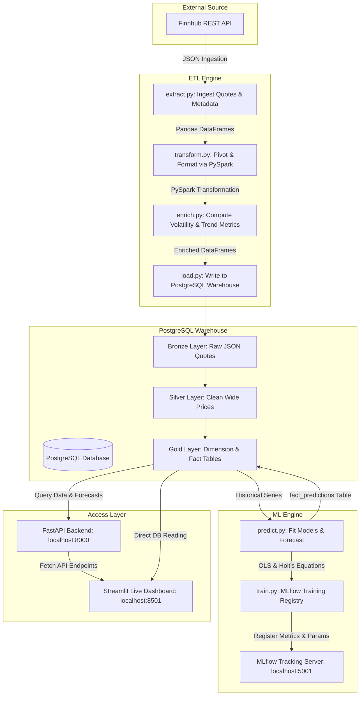

# 📈 Finnhub Real-Time Stock Streaming Pipeline & ML Forecasting Dashboard

[](https://www.python.org/)
[](https://spark.apache.org/)
[](https://www.postgresql.org/)
[](https://fastapi.tiangolo.com/)
[](https://streamlit.io/)
[](https://mlflow.org/)
[](https://www.docker.com/)

A premium, production-grade real-time stock market data engineering pipeline, analytical warehouse, and predictive machine learning forecasting dashboard. The application extracts streaming market quotes via the **Finnhub API**, processes them using **PySpark**, stores them in a **multi-layered PostgreSQL database** (Bronze → Silver → Gold), trains double exponential smoothing models logged to **MLflow**, and exposes the analytics via a robust **FastAPI** backend and an interactive, highly polished dark-themed **Streamlit** dashboard.

> **Key Enhancement:** The pipeline supports **four distinct timeframe granularities** — Days, Weeks, Months, and Years — allowing users to analyze stock data and ML forecasts at any temporal resolution.

---

## 📑 Table of Contents

- [Architecture & Flow](#-comprehensive-architecture--flow)
- [Features Overview](#-features-overview)
- [Multi-Timeframe Design](#-multi-timeframe-design-days-weeks-months-years)
- [ETL Pipeline Deep-Dive](#-etl-pipeline-deep-dive)
- [Database Warehouse Schema](#-database-warehouse-schema-postgresql)
- [Machine Learning & Forecasting](#-deep-dive-machine-learning--forecasting-models)
- [Streamlit Dashboard](#-streamlit-dashboard)
- [Dashboard Enhancements & Hotfixes](#-dashboard-enhancements--hotfixes)
- [API Reference (FastAPI)](#-api-reference-fastapi)
- [Installation & Deployment](#-installation--deployment-guide)
- [Common Troubleshooting](#-common-troubleshooting)

---

## 🏛️ Comprehensive Architecture & Flow

The system is built as a modular, containerized multi-service architecture using Docker Compose. The diagram below illustrates the end-to-end data flow from the external financial APIs to the final visualization and tracking layers:



---

## 💎 Features Overview

| # | Feature | Description |
|---|---------|-------------|
| 1 | **Robust Streaming ETL Engine** | Extract real-time quotes from the Finnhub API and transform raw values with high-performance PySpark schemas. |
| 2 | **Multi-Timeframe Granularity** | Analyze stock data at **Day**, **Week**, **Month**, or **Year** resolution. All historical and prediction records use a standard SQL `DATE` column (`time_index` / `predicted_time`). |
| 3 | **Multi-Layered Data Warehouse** | Clean database warehousing with **Bronze** (raw landing), **Silver** (cleaned wide structure), and **Gold** (analytical star schema) layers. |
| 4 | **Double ML Forecasting Suite** | Fits two distinct models — OLS Linear Trend and Holt's Double Exponential Smoothing (damped trend) — to project future stock pricing with 95% confidence intervals. |
| 5 | **Centralized MLflow Tracking** | Logs every training run's hyperparameters, performance metrics ($MAE$, $RMSE$, $MAPE$, $R^2$), and prediction CSVs in a Postgres-backed MLflow Registry. |
| 6 | **FastAPI Serving Layer** | Exposes clean REST API endpoints for live price polling, commodity lists, historical trends, model predictions, and stock comparisons. |
| 7 | **Premium Streamlit Dashboard** | Interactive dark-themed UI with micro-animations, spline chart visualization, shaded ML forecasting confidence bands, and sub-second page loads from the PostgreSQL Gold layer. |
| 8 | **13-Stock Multi-Sector Watchlist** | Tracks AAPL, MSFT, NVDA, AMZN, GOOGL, META, TSLA, JPM, BAC, V, JNJ, UNH, XOM across Technology, Consumer Cyclical, Finance, Healthcare, and Energy sectors. |

---

## 🔄 Multi-Timeframe Design (Days, Weeks, Months, Years)

The system processes and stores historical stock data at **four distinct temporal granularities**. This is a core architectural feature that flows through every layer of the system.

### How Time Aggregation Works

| Timeframe | `timeframe` value | `time_index` meaning | Aggregation Logic |
|-----------|-------------------|---------------------|-------------------|
| **Days** | `'day'` | The specific trading date (e.g. `2026-05-22`) | Direct mapping from daily candles |
| **Weeks** | `'week'` | The Monday of that ISO week (e.g. `2026-05-18`) | Open = first day's open, Close = last day's close, High = max, Low = min |
| **Months** | `'month'` | The 1st of that calendar month (e.g. `2026-05-01`) | Same OHLC aggregation logic across the full month |
| **Years** | `'year'` | January 1st of that year (e.g. `2026-01-01`) | Same OHLC aggregation across the full year |

### Why Unified `DATE` Columns?

Instead of using separate `year INT`, `week_number INT`, or `day_string VARCHAR` columns, every record uses a **single SQL `DATE` column** (`time_index` for history, `predicted_time` for forecasts). This guarantees:

- **Plotly** handles all time axes automatically and smoothly across zoom levels
- Database queries, filters, and ordering use simple `WHERE time_index BETWEEN x AND y`
- No ambiguity about what "week 22" means — it's always the Monday date

### Continuous Index Forecasting (No Gaps!)

Fitting OLS and Holt's directly on calendar dates creates mathematical distortions due to year/month boundaries or weekend gaps. Instead, the pipeline:

1. Converts calendar dates into a **continuous time index** ($0, 1, 2, 3...$) prior to model fitting
2. Fits the mathematical models on this clean integer sequence
3. Projects the future $T+1, T+2, T+3$ indices
4. Maps the projected indices back to actual future dates using the appropriate offset (days, weeks, months, or years)

This ensures mathematically correct extrapolation and smooth forecast curves.

---

## ⚙️ ETL Pipeline Deep-Dive

The pipeline runs end-to-end via `python main.py` inside the Docker container. Here is a detailed walkthrough of each stage:

### Step 1: Extract (`etl/extract.py`)

```
Extract → 15,340 raw rows across 13 tickers
```

- **Finnhub REST API**: Fetches daily candlestick data (`/stock/candle`) and real-time quotes (`/quote`) for each of the 13 configured stock symbols.
- **Multi-Timeframe Aggregation**: From the daily candles, the extractor generates four sets of OHLCV data:
  - **Days**: Direct daily candles (trading days only)
  - **Weeks**: Grouped by ISO week Monday
  - **Months**: Grouped by 1st of month
  - **Years**: Grouped by January 1st
- **Fallback Demo Data**: If the Finnhub API key is missing or returns 403 errors, the system generates synthetic price projections from the latest available quote, ensuring the pipeline always runs successfully.
- **Output**: A Pandas DataFrame with columns: `country_code`, `country_name`, `indicator`, `timeframe`, `time_index`, `value`, `source`.

### Step 2: Transform (`etl/transform.py`)

```
Transform → PySpark pivot: 15,340 long rows → 3,068 wide rows × 9 columns
```

- **Pandas → Spark**: Converts the extracted Pandas DataFrame into a PySpark DataFrame with a strict schema including `timeframe (StringType)` and `time_index (StringType → DateType)`.
- **Pivot Wide**: Groups by `[country_code, country_name, timeframe, time_index]` and pivots the indicator values into separate columns: `open_price`, `high_price`, `low_price`, `close_price`, `latest_price`.
- **Missing Price Cleanup**: Drops any rows where all five price columns are null.

### Step 3: Enrich (`etl/enrich.py`)

```
Enrich → 18 enriched columns including trend, volatility, and category metrics
```

- **Stock Sector Mapping**: Maps each ticker to its sector (Technology, Consumer Cyclical, Finance, Healthcare, Energy) via a built-in dictionary.
- **Price Movement Analysis**: Using PySpark Window functions partitioned by `[country_code, timeframe]` and ordered by `time_index`:
  - `price_change`: Absolute change from the previous period's close
  - `price_change_pct`: Percentage change
  - `price_trend`: Categorical label (`up`, `down`, `flat`, `new`)
- **Volatility Metrics**:
  - `intraday_range`: High minus Low price
  - `intraday_range_pct`: Percentage spread
  - `volatility_level`: `low` (<2%), `medium` (2-5%), `high` (>5%)
- **Category Averages**: Rolling sector-wide average close price and count of stocks, computed per `[commodity_category, timeframe, time_index]`.

### Step 4: Load (`etl/load.py`)

```
Load → Bronze (15,340 rows) → Silver (3,068 rows) → Gold (13 dim + 3,068 fact)
```

- **Bronze Layer**: Writes all raw extracted rows to `bronze.raw_commodity_prices` (one row per ticker per timeframe per date per indicator).
- **Silver Layer**: Writes the pivoted, cleaned wide-format rows to `silver.commodity_prices`.
- **Gold Layer**:
  - `gold.dim_commodity`: 13-row dimension table with `commodity_id`, `symbol`, `commodity_name`, `commodity_category`.
  - `gold.fact_commodity_prices`: 3,068-row fact table with foreign key to `dim_commodity`, containing all enriched price metrics per `(commodity_id, timeframe, time_index)`.

### Step 5a: Predict (`etl/predict.py`)

```
Predict → 1,560 forecasts (13 tickers × 5 indicators × 4 timeframes × 2 models × 3 horizon steps)
```

- Reads historical data from `gold.fact_commodity_prices`.
- For each `(ticker, timeframe, indicator)` combination with at least 3 observations:
  - Fits **Linear Trend** (OLS) and **Holt's Smoothing** models
  - Generates 3-step-ahead forecasts with 95% confidence intervals
  - Maps projected steps to actual future dates
- Writes all predictions to `gold.fact_predictions` with columns: `commodity_id`, `timeframe`, `indicator`, `model_name`, `predicted_time`, `predicted_value`, `confidence_low`, `confidence_high`.

### Step 5b: MLflow Training (`04_ml/training/train.py`)

```
MLflow → 8 experiment runs (2 models × 4 timeframes), all logged with params/metrics/artifacts
```

- Loops over all four timeframes and both model types.
- For each combination, opens an MLflow run and logs:
  - **Parameters**: `model_name`, `timeframe`, `horizon`, `min_obs`, `test_size`, `n_tickers`, `n_indicators`
  - **Metrics**: `avg_mae`, `avg_rmse`, `avg_mape`, `avg_r2`, `n_predictions`
  - **Artifacts**: CSV files of predictions and evaluation metrics
  - **Tags**: `project`, `team`, `timeframe`
- Uses hold-out evaluation (last 1 data point) to compute out-of-sample error metrics.

---

## 🗄️ Database Warehouse Schema (PostgreSQL)

The database `econ_pipeline` is organized into three layers following data warehousing best practices:

```text
econ_pipeline/
├── bronze/
│   └── raw_commodity_prices         # Raw JSON-like records from Finnhub quotes
├── silver/
│   └── commodity_prices             # Clean wide stock price rows
└── gold/
    ├── dim_commodity                # Dimension: Symbol, Name, Sector
    ├── fact_commodity_prices        # Fact: Historical price metrics per timeframe
    └── fact_predictions             # Fact: ML forecasting bounds & values per timeframe
```

### Gold Layer Table Definitions

#### `gold.dim_commodity`
| Column | Type | Description |
|--------|------|-------------|
| `commodity_id` | `SERIAL PK` | Auto-incrementing surrogate key |
| `symbol` | `VARCHAR(20)` | Stock ticker (e.g. `AAPL`) |
| `commodity_name` | `VARCHAR(200)` | Company name (e.g. `Apple Inc.`) |
| `commodity_category` | `VARCHAR(100)` | Market sector (e.g. `Technology`) |
| `created_at` | `TIMESTAMPTZ` | Record creation timestamp |

#### `gold.fact_commodity_prices`
| Column | Type | Description |
|--------|------|-------------|
| `id` | `SERIAL PK` | Auto-incrementing surrogate key |
| `commodity_id` | `INT FK` | References `dim_commodity` |
| `timeframe` | `VARCHAR(10)` | One of: `day`, `week`, `month`, `year` |
| `time_index` | `DATE` | Start date of the period |
| `open_price` | `FLOAT8` | Opening price |
| `high_price` | `FLOAT8` | Period high |
| `low_price` | `FLOAT8` | Period low |
| `close_price` | `FLOAT8` | Closing price |
| `latest_price` | `FLOAT8` | Most recent price |
| `price_change` | `FLOAT8` | Absolute change from previous period |
| `price_change_pct` | `FLOAT8` | Percentage change |
| `price_trend` | `VARCHAR(10)` | `up`, `down`, `flat`, or `new` |
| `intraday_range` | `FLOAT8` | High - Low |
| `intraday_range_pct` | `FLOAT8` | Range as % of close |
| `volatility_level` | `VARCHAR(10)` | `low`, `medium`, or `high` |
| `category_avg_close` | `FLOAT8` | Sector average close price |
| `category_count` | `INT` | Number of stocks in sector |
| `loaded_at` | `TIMESTAMPTZ` | When the row was loaded |

**Unique Constraint:** `(commodity_id, timeframe, time_index)`

#### `gold.fact_predictions`
| Column | Type | Description |
|--------|------|-------------|
| `id` | `SERIAL PK` | Auto-incrementing surrogate key |
| `commodity_id` | `INT FK` | References `dim_commodity` |
| `timeframe` | `VARCHAR(10)` | One of: `day`, `week`, `month`, `year` |
| `indicator` | `VARCHAR(100)` | Price metric (e.g. `close_price`) |
| `model_name` | `VARCHAR(100)` | `linear_trend` or `holt_smoothing` |
| `predicted_time` | `DATE` | The future date being forecasted |
| `predicted_value` | `NUMERIC(18,4)` | Point forecast |
| `confidence_low` | `NUMERIC(18,4)` | Lower 95% confidence bound |
| `confidence_high` | `NUMERIC(18,4)` | Upper 95% confidence bound |
| `run_at` | `TIMESTAMPTZ` | When the prediction was generated |

**Unique Constraint:** `(commodity_id, timeframe, indicator, model_name, predicted_time)`

### Table Name Mappings
To maintain compatibility with the original agricultural codebase, stock metadata is mapped as follows:
* `symbol` = Stock Ticker (e.g. `AAPL`)
* `commodity_name` = Company Name (e.g. `Apple Inc.`)
* `commodity_category` = Sector Name (e.g. `Technology`)

---

## 🔮 Deep-Dive: Machine Learning & Forecasting Models

The system fits two distinct forecasting algorithms to predict stock pricing (Open, High, Low, Close, and Latest prices) over a **3-step horizon** for each timeframe:

| Timeframe | Forecast Horizon | Example |
|-----------|-----------------|---------|
| Days | Next 3 trading days | May 23, 24, 25 |
| Weeks | Next 3 weeks | May 26, Jun 2, Jun 9 |
| Months | Next 3 months | Jun 1, Jul 1, Aug 1 |
| Years | Next 3 years | 2027, 2028, 2029 |

### 1. Ordinary Least Squares (OLS) Linear Trend
Fits a straight line through all historical points by minimizing the sum of squared residuals. It treats all historical observations with equal weight.
* **Equation:**
  $$\hat{y}_t = \beta_0 + \beta_1 \cdot t$$
* **Uncertainty Estimation:** Calculates standard regression prediction intervals that grow wider as the forecast steps project further away from the sample mean:
  $$SE_{pred} = s \cdot \sqrt{1 + \frac{1}{n} + \frac{(t - \bar{t})^2}{\sum (t_i - \bar{t})^2}}$$

### 2. Holt's Double Exponential Smoothing (Damped Trend)
An advanced time series forecasting method that incorporates both level and trend components. It applies exponential weights, placing **higher weight on recent observations** and lower weight on older data. It also incorporates a damping parameter ($\phi$) to prevent the trend from over-extrapolating indefinitely into the future.
* **Level Equation:**
  $$L_t = \alpha \cdot y_t + (1 - \alpha)(L_{t-1} + \phi \cdot T_{t-1})$$
* **Trend Equation:**
  $$T_t = \beta(L_t - L_{t-1}) + (1 - \beta) \cdot \phi \cdot T_{t-1}$$
* **Forecast Equation:**
  $$\hat{y}_{t+h} = L_t + \sum_{i=1}^{h} \phi^i \cdot T_t$$
* **Uncertainty Estimation:** Spreads the confidence interval using the in-sample RMSE scaled by the step duration $h$:
  $$Margin = 1.96 \cdot RMSE_{in\_sample} \cdot \sqrt{h}$$

### 🔬 Model Divergence Analysis
When viewing highly linear stocks like **JPM**, **AAPL**, or **AMZN** in the dashboard, the OLS and Holt forecast lines may look identical. This happens because these stocks had remarkably stable, straight-line growth. Because the history contains no curvature, weighting recent points more (Holt) or weighting all points equally (OLS) yields the same constant slope.

For non-linear or accelerating stocks like **NVDA**, **BAC**, or **MSFT**, the models **diverge significantly** because Holt's detects and prioritizes recent acceleration, while OLS is anchored by older historical data.

---

## 🖥️ Streamlit Dashboard

The Streamlit dashboard provides two main views accessible via sidebar navigation:

### 📡 Live & History View
- **Summary Cards**: Avg Close Price, Avg Change %, Stocks Going Up/Down, High Volatility count
- **Live Prices Panel** (`@st.fragment`, updates every 30s): Displays real-time stock prices sourced from the PostgreSQL Gold layer (no external API calls during rendering), with color-coded direction indicators and a live streaming price chart
- **Price History Chart**: Interactive Plotly spline chart with gradient area fill for single-stock view, multi-stock comparison mode, and selectable price metric (Open/High/Low/Close)
- **Sector Breakdown**: Donut chart showing stock distribution across market sectors
- **Sidebar Filters**: Timeframe granularity selector (Days/Weeks/Months/Years, default: Weeks), sector multi-select filter, date range slider, and ticker/company search

### 🔮 ML Forecasting View
- **Model Selector**: Choose stock ticker, forecasting model (Linear Trend / Holt's Smoothing), and target indicator
- **Forecast Timeline Chart**: Historical line (solid purple) seamlessly joined with forecast line (dashed cyan), surrounded by a shaded 95% confidence interval band
- **Detailed Forecast Table**: Exact predicted values, confidence bounds, and spread percentages for the 3-step horizon
- **Run Metadata Cards**: Active model name and last pipeline run timestamp (displayed in Phnom Penh UTC+7 timezone)

---

## 🛠️ Dashboard Enhancements & Hotfixes

We implemented **10+ critical visual and functional enhancements** to provide a high-end, premium look and resolve runtime exceptions:

1. **🔢 1-Based DataFrame Indexing:** Tables index starting at `1` instead of the pandas default `0`.
2. **📈 13-Stock Multi-Sector Watchlist:** Tracking `AAPL`, `MSFT`, `NVDA`, `AMZN`, `GOOGL`, `META`, `TSLA`, `JPM`, `BAC`, `V`, `JNJ`, `UNH`, `XOM` across 5 sectors.
3. **🇰🇭 UTC+7 Phnom Penh Time Zone:** All displayed timestamps use Phnom Penh local time (UTC+7).
4. **🔍 Dark-Theme Styled Sidebar Search:** Custom-styled search with real-time match counter.
5. **💊 Custom Styled Multiselect Pills:** Dark-themed filter tags blending with the UI.
6. **📊 Visual Chart Padding Fixes:** Expanded Plotly margins to prevent label/legend clipping.
7. **🔮 Multi-Page Sidebar Navigation:** Toggle between `📡 Live & History` and `🔮 ML Forecasting`.
8. **📉 Spline Interpolation & Gradient Area Charts:** Smooth spline curves with gradient-filled area charts for single-stock views.
9. **🛡️ Shaded 95% Confidence Interval Ribbons:** Beautiful semi-transparent forecast uncertainty bands.
10. **🎬 Premium Micro-Animations:** Pop-up entry animations on all dashboard elements (metric cards, charts, tables, form controls) triggered on every refresh, so users can visually confirm that data has updated.
11. **🔴 Live Pulse Indicator:** Animated CSS pulse dot next to the "Live Prices" header to indicate active data streaming.
12. **⏱️ Sub-Second Page Loads:** Dashboard reads exclusively from PostgreSQL Gold layer — no external API calls during rendering.

---

## 🔌 API Reference (FastAPI)

FastAPI serves data at `http://localhost:8000`. Key endpoints include:

| Endpoint | Method | Description |
| :--- | :--- | :--- |
| `/health` | `GET` | Verifies API health and PostgreSQL database connection status. |
| `/quote?symbol=AAPL` | `GET` | Pulls a live stock quote directly from the Finnhub API. |
| `/commodities` | `GET` | Fetches the complete list of 13 tracked stock symbols and metadata. |
| `/prices` | `GET` | Lists all historical database price entries. |
| `/prices/{symbol}` | `GET` | Retrieves the stored price history for a specific ticker symbol. |
| `/predictions/{symbol}` | `GET` | Retrieves the future forecasts and confidence bounds for a ticker. |
| `/categories` | `GET` | Returns all available stock sectors (e.g., Technology, Healthcare, Energy). |
| `/top?indicator=close_price&n=5` | `GET` | Ranks the top `N` stocks based on a specific price metric. |
| `/compare?symbols=AAPL,MSFT` | `GET` | Pulls side-by-side comparative historical datasets for multiple symbols. |

---

## 🚀 Installation & Deployment Guide

### Prerequisites
- **Docker Desktop** installed and running
- A **Finnhub API key** (free tier: [finnhub.io](https://finnhub.io/register))

### Step 1: Clone and Configure Environment

```bash
git clone https://github.com/Menghong-Heng/Stock_Market_realtime.git
cd Stock_Market_realtime
cp .env.example .env
```

Edit your `.env` file to configure your credentials:
```env
DB_HOST=localhost
DB_PORT=55432
DB_NAME=econ_pipeline
DB_USER=Menghong
DB_PASSWORD=your_password

FINNHUB_API_KEY=your_finnhub_api_key
FINNHUB_SYMBOLS=AAPL,MSFT,NVDA,AMZN,GOOGL,META,TSLA,JPM,BAC,V,JNJ,UNH,XOM
FINNHUB_HISTORY_YEARS=5

# MLflow Central Tracking Server
MLFLOW_TRACKING_URI=http://localhost:5001
```

### Step 2: Spin Up the Docker Containers

Ensure Docker Desktop is open and run Compose to build and start the infrastructure:
```bash
# Start core services (database + MLflow)
docker compose up -d postgres mlflow

# Start application services (API + Dashboard)
docker compose up -d api dashboard
```

This will initialize four services:
| Service | URL | Description |
|---------|-----|-------------|
| **PostgreSQL** | `localhost:55432` | Data warehouse (Bronze/Silver/Gold layers) |
| **MLflow** | `http://localhost:5001` | Experiment tracking server |
| **FastAPI** | `http://localhost:8000` | REST API backend |
| **Streamlit** | `http://localhost:8501` | Interactive dashboard |

### Step 3: Run the ETL & ML Training Pipeline

To populate your warehouse with historical data, compute analytical metrics, generate ML forecasts, and log runs to MLflow:

```bash
# Run the entire pipeline end-to-end inside Docker:
docker compose run --rm pipeline

# Alternatively, run only the ML training/logging script locally:
python 04_ml/training/train.py
```

> **Note:** The pipeline should always be run inside Docker (`docker compose run --rm pipeline`) to avoid PySpark compatibility issues on Windows. The Docker container includes Java 17 and all required dependencies.

### Step 4: Access your Dashboards!
* 📊 **[http://localhost:8501](http://localhost:8501)** — Explore the dark-theme Stock Dashboard, view live quote streaming, toggle between timeframe granularities, and analyze forecast predictions.
* 📈 **[http://localhost:5001](http://localhost:5001)** — Select **`finnhub-stock-forecasting`** under experiments to view logged model parameters, average error metrics, and download prediction artifacts.
* 🔌 **[http://localhost:8000/docs](http://localhost:8000/docs)** — Interactive Swagger API documentation.

---

## 🗂️ Project Structure

```
Stock_Market_realtime/
├── 03_warehouse/                    # SQL schema definitions
│   ├── bronze/schema.sql           # Raw landing layer
│   ├── silver/schema.sql           # Cleaned wide layer
│   └── gold/schema.sql             # Analytical star schema
├── 04_ml/                           # Machine Learning
│   ├── mlflow/mlflow_config.yaml   # MLflow configuration
│   └── training/
│       ├── train.py                # MLflow-tracked training loop
│       └── evaluate.py             # Metric computation utilities
├── 05_app/                          # Application Layer
│   ├── api/app.py                  # FastAPI backend
│   └── dashboard/dashboard.py      # Streamlit frontend
├── etl/                             # ETL Pipeline
│   ├── extract.py                  # Data extraction & multi-TF aggregation
│   ├── transform.py                # PySpark transformation & pivoting
│   ├── enrich.py                   # Feature engineering & enrichment
│   ├── load.py                     # PostgreSQL loading (B/S/G layers)
│   └── predict.py                  # ML forecasting & prediction writing
├── main.py                          # Pipeline orchestrator
├── docker-compose.yml               # Container service definitions
├── Dockerfile                       # Python 3.11 + Java 17 image
├── requirements.txt                 # Python dependencies
└── .env.example                     # Environment variable template
```

---

## 🛠️ Common Troubleshooting

### Unicode/Emoji Terminal Error on Windows
If running the training script locally yields a `UnicodeEncodeError` when printing console emojis:
```powershell
$env:PYTHONIOENCODING="utf-8"; python 04_ml/training/train.py
```

### MLflow Empty UI History
If experiments are missing in MLflow, ensure:
1. `MLFLOW_TRACKING_URI=http://localhost:5001` is set in your `.env` file
2. When running inside Docker, the pipeline uses `http://mlflow:5001` (configured automatically in `docker-compose.yml`)
3. Execute `docker compose run --rm pipeline` or `python 04_ml/training/train.py` to stream metrics

### PySpark Windows Compatibility
PySpark 4.x's `daemon.py` crashes on Windows because it attempts to import Unix-only signals (`SIGHUP`, `SIGCHLD`). **Always run the pipeline inside the Docker container:**
```bash
docker compose run --rm pipeline
```

### Pipeline Container Can't Reach MLflow
If the pipeline fails at Step 5b with `ConnectionRefusedError` to `localhost:5001`:
- The `docker-compose.yml` must include `MLFLOW_TRACKING_URI: http://mlflow:5001` in the pipeline service environment
- The `mlflow` service must be listed as a dependency with `condition: service_started`

### Database Connection Issues
If the dashboard shows "Cannot connect to database":
1. Verify PostgreSQL is running: `docker compose ps`
2. Check your `.env` credentials match the `docker-compose.yml` environment
3. Ensure port `55432` is not blocked by firewall
